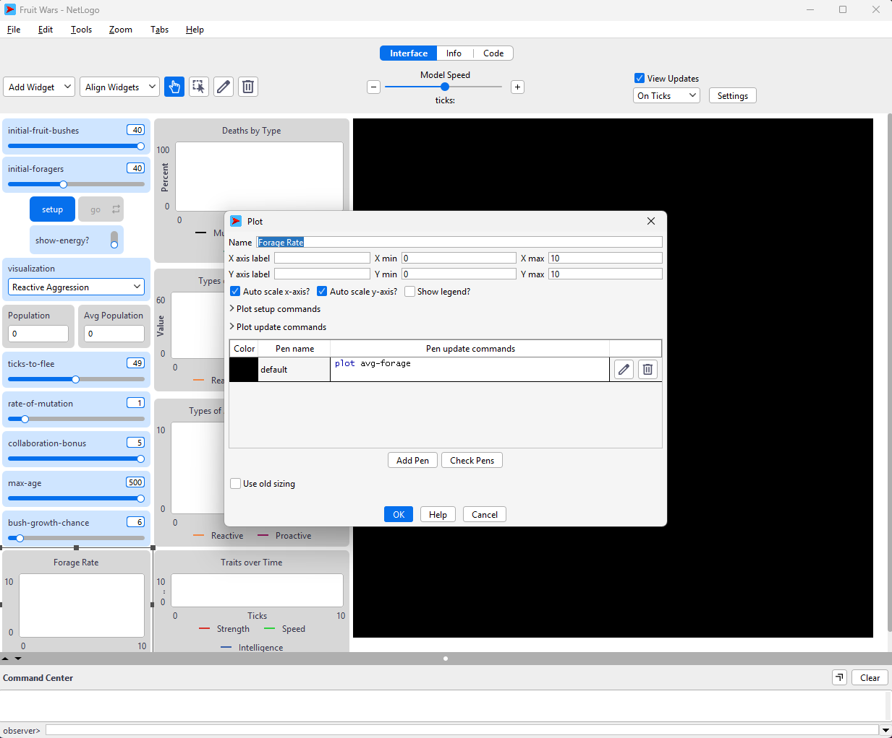
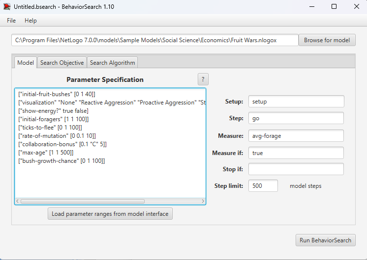
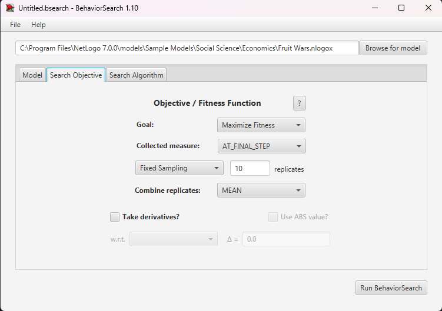
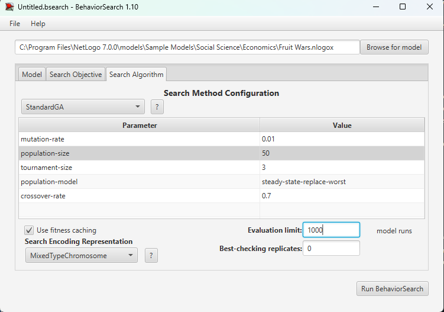
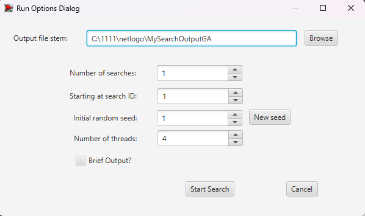
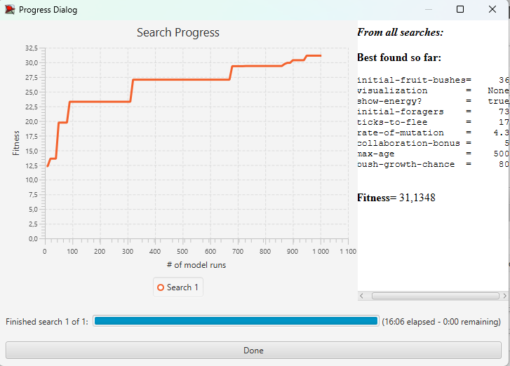
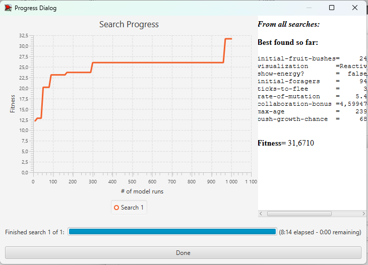

## Комп'ютерні системи імітаційного моделювання
## СПм-22-11, **Іванов Іван Іванович**
### Лабораторна робота №**3**. Використання засобів обчислювального интелекту для оптимізації імітаційних моделей

 

### Варіант 0, модель у середовищі NetLogo:
[Traffic 2 Lanes](http://www.netlogoweb.org/launch#http://www.netlogoweb.org/assets/modelslib/Sample%20Models/Social%20Science/Traffic%202%20Lanes.nlogo)

 

#### Вербальний опис моделі:
*У цьому разі опис необхідний, оскільки в аналогічних прикладах для першої та другої лабораторних робіт використовувалася інша імітаційна модель, і я не можу просто дати посилання на опис з минулої лабораторної роботи (звичайним посиланням на власний md-файл власного репозиторію). Тут і далі **курсивом відзначені мої коментарі**, для кращого пояснення опису роботи. **Повторювати їх у власних описах не потрібно.***  
Ускладнена версія моделі [Traffic Basic](http://www.netlogoweb.org/launch#http://www.netlogoweb.org/assets/modelslib/Sample%20Models/Social%20Science/Traffic%20Basic.nlogo). Симуляція руху автомобілів по двосмуговому шосе, де кожен автомобіль на дорозі слідує простому набору правил: уповільнюється при наближенні до автомобіля перед собою (*наздоганяє його, і, щоб не врізатися, гальмує*), або прискорюється, якщо попереду немає іншого автомобіля. Також є можливість змінити смугу руху, якщо водієві набридло гальмувати і сусідня смуга вільна. Модель показує, як можуть утворюватися пробки.

#### Керуючі параметри:
- **number-of-cars** визначає кількість агентів у середовищі моделювання, тобто, в даній моделі, кількість машин на замкнутому шосе.
- **deceleration** визначає ступінь зменшення швидкості агента на кожному такті симуляції у разі наявності перешкоди перед ним.
- **acceleration** визначає ступінь збільшення швидкості агента на кожному такті симуляції за відсутності перешкод перед агентом.
- **max-patience** визначає, скільки разів автомобіль може знизити свою швидкість, перш ніж у його водія "закінчиться терпіння" і він спробує змінити смугу руху.

#### Показники роботи модеі:
- максимальна швидкість на поточному такті, тобто, швидкість найшвидшої на даний момент машини.
- найменша швидкість на поточному такті, тобто, швидкість найповільнішої в даний момент машини.
- середня швидкість руху машин на шосе.
- поточна швидкість окремої машини, що відстежується (червона машина).

 

### Налаштування середовища BehaviorSearch:

**Обрана модель**:
<pre>
C:\Program Files\NetLogo 6.3.0\models\Sample Models\Social Science\Traffic 2 Lanes.nlogo
</pre>
**Параметри моделі** (вкладка Model):  
*Параметри та їх модливі діапазони були **автоматично** вилучені середовищем BehaviorSearch із вибраної імітаційної моделі, для цього є кнопка «Завантажити діапазони параметрів із інтерфейсу моделі»*:
<pre>
["number-of-cars" 10]
["acceleration" [0.001 0.001 0.01]]
["deceleration" [0.01 0.01 0.1]]
["max-patience" [1 1 100]] 
</pre>
*Кількість машин було знижено мною, в порівнянні зі значенням за замовчуванням, для скорочення часу симуляції, оскільки налаштування цієї моделі демонструвалося на лекції і був сенс не затягувати необхідний для аналізу час.*  
Використовувана **міра**:  
Для фітнес-функції *(вона ж функція пристосованості або цільова функція)* було обрано **значення середньої швидкості всіх машин на трасі**, вираз для її розрахунку взято з налаштувань графіка аналізованої імітаційної моделі в середовищі NetLogo  
  
та вказано у параметрі "**Measure**":
<pre>
mean [ speed ] of turtles
</pre>
Середня швидкість всіх машин на трасі повинна враховуватися **в середньому** за весь період симуляції тривалістю, *для приклада*, 500 тактів (адже на кожному такті є своє значення поточної середньої швидкості усіх учасників дорожного руху), починаючи з 0 такту симуляції.  
*Параметр "**Mesure if**" зі значення true, по суті, і означає, що враховуватимуться всі такти симуляції, а чи не частина їх. Іноді має сенс не враховувати деякі такти через хаос в деяких моделях на початку їх використання. Наприклад, це показано в прикладі з документації BehaviorSearch.  
Параметри "**Setup**" та "**Go**" вказують відповідні процедури ініціалізації та запуску в логіці моделі (зазвичай вони так і називаються). BehaviorSearch в процесі роботи, по суті, замість користувача запускає ці процедури.*  
Параметр зупинки за умовою ("**Stop if**") у разі не використовувався.  
Загальний вигляд вкладки налаштувань параметрів моделі:  

**Налаштування цільової функції** (вкладка Search Objective):  
Метою підбору параметрів імітаційної моделі, що описує дорожній рух двосмуговим шосе, є **максимізація** значення середньої швидкості машин на трасі – це вказано через параметр "**Goal**" зі значенням **Maximize Fitness**. Тобто необхідно визначити такі параметри налаштувань моделі, у яких машини рухаються з максимальною швидкістю. При цьому цікавить не просто середня швидкість всіх машин у якийсь окремий момент симуляції, а середнє її значення за всю симуляцію (тривалість якої (500 кроків) вказувалася на минулій вкладці). Для цього у параметрі "**Collected measure**", що визначає спосіб обліку значень обраного показника, вказано **MEAN_ACROSS_STEPS**.  
Щоб уникнути викривлення результатів через випадкові значення, що використовуються в логіці самої імітаційної моделі, **кожна симуляція повторюється по 10 разів**, результуюче значення розраховується як **середнє арифметичне**. *Якщо вважаєте вплив випадковості на те, що відбувається в обраній вами імітаційній моделі незначним - то повторні симуляції можуть бути і не потрібні.*  
Загальний вигляд вкладки налаштувань цільової функції:  

**Налаштування алгоритму пошуку** (вкладка Search Algorithm):  
*На цьому етапі було визначено модель, налаштовано її параметри (тобто вказано, які з них незмінні, а які в процесі пошуку можуть змінюватися і в яких діапазонах), і обрано міру, що лежить в основі функції пристосованості, що дозволяє оцінити якість кожного перевіряємого BehaviorSearch варіантів рішення.  
У ході дослідження на лабораторній роботі використовуються два алгоритми: Випадковий пошук(**RandomSearch**) і Простий генетичний алгоритм (**StandardGA**).  
Для цих алгоритмів, що вирішують завдання пошуку такого набору параметрів імітаційної моделі, щоб задовольнити вимоги користувача (у нашому випадку – максимізувати значення середньої швидкості переміщення агентів у заданій імітаційній моделі), необхідно вказати "**Evaluation limit**" (число ітерацій пошуку, у разі ГА – це буде кількість поколінь), та "**Search Space Encoding Representation**" (спосіб кодування варіанта вирішення). Загальноприйнятого "кращого" способу кодування немає, треба куштувати, які підійдуть саме до вашої моделі.
Параметр "**Use fitness caching**" впливає лише на продуктивність.
Параметри, специфічні для генетичного алгоритму, можна використовувати за замовчанням, якщо це не завадить отримати результат. На захисті їх, звичайно, обговоримо.*  
Загальний вид вкладки налаштувань алгоритму пошуку:  

 

### Результати використання BehaviorSearch:
Діалогове вікно запуску пошуку *(можна залишити за замовчуванням, але стежте, куди пишеться результат)*:  

Результат пошуку параметрів імітаційної моделі, використовуючи **генетичний алгоритм**:  

Результат пошуку параметрів імітаційної моделі, використовуючи **випадковий пошук**:  
